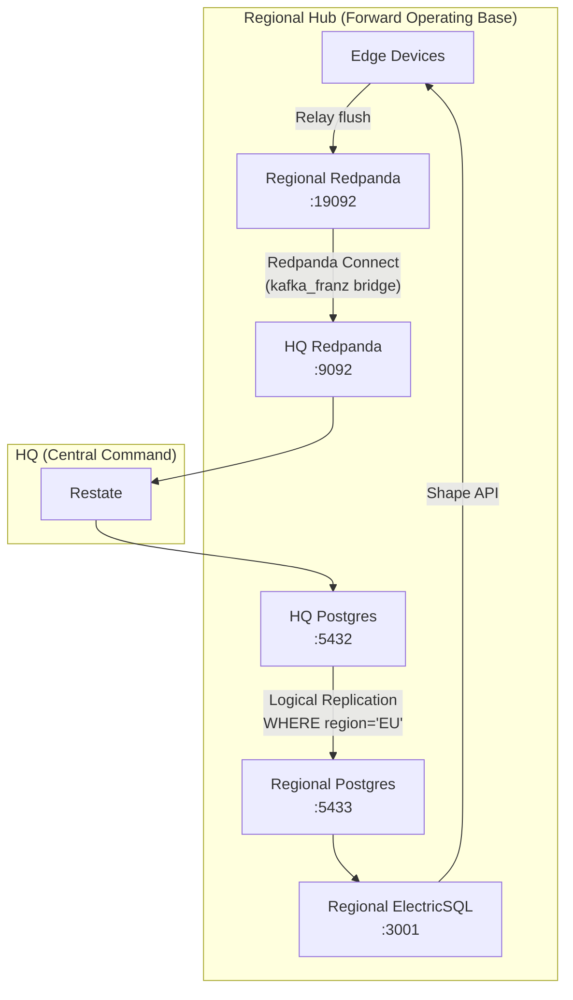

# OpenDDIL Regional Stack — Forward Operating Base

Regional hub infrastructure for the OpenDDIL framework. Supports a **Tiered Hub-and-Spoke** architecture where Regional hubs buffer writes and hold a subset of HQ data for their Edge clients.

> [!CAUTION]
> **Restate runs ONLY at HQ** — never at a Regional hub. Regional hubs are data proxies and event buffers. All event processing happens centrally at HQ to prevent split-brain state corruption.

> [!TIP]
> **100% open-source.** Uses Redpanda Connect (formerly Benthos) instead of enterprise-licensed MirrorMaker 2 or Cluster Linking.

## Architecture



## Autonomous Operation

The Regional hub operates **fully autonomously** when disconnected from HQ:

| Scenario | Behavior |
|---|---|
| **Uplink lost** | Redpanda Connect buffers events locally; Edge reads stale-but-consistent data |
| **Uplink restored** | Connect automatically flushes the entire backlog to HQ |
| **Degraded bandwidth** | Zstd compression + batching (100 msgs / 2s) minimizes wire usage |
| **Intermittent link** | Exponential backoff retries; consumer group offsets prevent re-processing |

## Key Files

| File | Purpose |
|---|---|
| `docker-compose.yml` | Regional Postgres, Redpanda, Console, ElectricSQL, Redpanda Connect |
| `connect/redpanda-connect.yaml` | Bridge config: `kafka_franz` input→output with DDIL retry |
| `replication/hq_to_regional.sql` | Postgres logical replication with `WHERE region = 'EU'` |

## Quick Start

```bash
# 1. Start HQ stack first
cd ../openddil-stack && docker compose up -d

# 2. Set up HQ publication (one-time)
docker compose exec postgres psql -U openddil -d openddil -f- <<'SQL'
ALTER TABLE inventory_items ADD COLUMN IF NOT EXISTS region TEXT NOT NULL DEFAULT 'HQ';
ALTER TABLE inventory_items REPLICA IDENTITY FULL;
CREATE PUBLICATION pub_inventory_eu FOR TABLE inventory_items WHERE (region = 'EU');
SQL

# 3. Start Regional stack
cd ../openddil-regional-stack && docker compose up -d

# 4. Create subscription on Regional Postgres
docker compose exec regional-postgres psql -U openddil -d openddil_regional -c "
  CREATE SUBSCRIPTION sub_inventory_from_hq
  CONNECTION 'host=host.docker.internal port=5432 dbname=openddil user=openddil password=openddil'
  PUBLICATION pub_inventory_eu WITH (copy_data = true);
"
```

## Port Mapping (avoids HQ conflicts)

| Service | HQ Port | Regional Port |
|---|---|---|
| PostgreSQL | 5432 | **5433** |
| Redpanda Kafka API | 9092 | **19092** |
| Redpanda Console | 8080 | **8081** |
| ElectricSQL Shape API | 3000 | **3001** |
| Redpanda Connect Health | — | **4195** |

## Why Redpanda Connect?

| Feature | Redpanda Connect | MirrorMaker 2 | Cluster Linking |
|---|---|---|---|
| **License** | Apache 2.0 ✅ | Apache 2.0 | Enterprise ❌ |
| **DDIL resilience** | Built-in backoff + backpressure | Manual config | Manual config |
| **Config** | Single YAML file | Complex properties + connectors | rpk CLI + licensing |
| **Footprint** | Single lightweight binary | JVM overhead | Requires Enterprise Redpanda |

## AI Documentation

| File | Purpose |
|---|---|
| [`llms.txt`](llms.txt) | Structured project summary for LLM discovery |
| [`.cursorrules`](.cursorrules) | Infrastructure conventions |
| [`AGENTS.md`](AGENTS.md) | AI agent safety guidelines |
